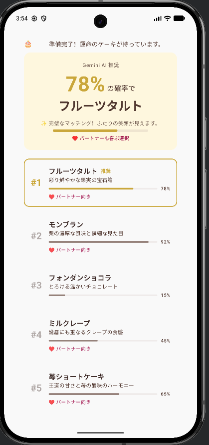

# 🎂 Cake Compiler：AIと僕らの「心の距離」を計算する

> **「彼女が本当に喜ぶケーキは、AIが知っているのか、それとも君が知っているのか？」**

<p align="center">
  
</p>

---

## 🤔 このアプリは何？

Cake Compiler（ケーキ・コンパイラ）は、**AIと一緒にケーキを選ぶアプリ**です。

でも、ちょっとだけ変わっています。

ふつうのAIアプリは「これがおすすめです！」と答えを出して終わりですよね。このアプリは違います。AIが「92%の確率（かくりつ）でモンブランがベストです」と提案したあとに、**あえて「君はどうしたい？」と聞いてくる**んです。

つまり、このアプリの本当のテーマは――

> **AIの計算と、人間の決断（けつだん）。どちらが「正解」なのか？**

その答えを、君自身に見つけてもらうために作りました。

---

## 📖 このアプリで学べる「AIとの付き合い方」

### 1. 🎲 AIは「確率」で話す

アプリの画面を見ると、それぞれのケーキに「92%」「78%」「45%」といった数字がついています。これはAI（このアプリでは Google の Gemini を想定しています）が、過去のデータを分析して出した**「予測（よそく）」**です。

ここで大切なのは、こういうことです。

> **「78%」は、78回当たって22回はずれる、という意味。100%の正解ではない。**

天気予報（てんきよほう）と同じです。「降水確率（こうすいかくりつ）80%」と言われても、傘（かさ）を持たずに出かけて晴れることだってありますよね。AIの数字は「たぶんこうだろう」という予測であって、未来を決定する魔法（まほう）の数字ではないんです。

このアプリでは、その数字を**バーの長さ**で見える化しています。「ふーん、AIはモンブランが一番だと思ってるんだな」と、まず**AIの意見を「聞く」**ところから始まります。

---

### 2. ✨ 最後の一瞬（The Final Bit）

さて、AIがモンブランを推（お）してきました。でも、君はティラミスが気になっている。

ティラミスのカードをタップすると、こんなことが起きます。

- 選んだカードがふんわり大きくなって、やさしいピンク色に変わる 🩷
- 画面の上のほうに**「あなたの手動選択（AI予測を上書き中）」**と表示される
- 画面の下に**「このケーキに決める」**というボタンが現れる

これが **"The Final Bit"**（ザ・ファイナル・ビット）です。コンピュータの世界で「ビット」は情報の最小単位（さいしょうたんい）。つまり、**「最後の最後に決めるたった1つの判断」**という意味を込めています。

ここで大切なのは、これは**AIを否定（ひてい）しているわけではない**ということ。

AIは「過去のデータによると、これがベストですよ」とアドバイスしてくれた。でも、最終的に選ぶのは君自身。これは、AIを「命令する上司（じょうし）」ではなく**「頼（たよ）れるアドバイザー」**として付き合うということです。

> **AIの提案を聞いたうえで、自分で決める。それが「対等（たいとう）な関係」。**

---

### 3. 🦋 思い出は計算できない（Butterfly Effect）

AIの推薦（すいせん）を上書きしてケーキを決めると、こんなメッセージがふわっと現れます。

> *「計算外の選択です。でも、あなたが彼女の『あの時の言葉』を覚えているなら、それが正解かもしれません。」*

これは **Butterfly Effect（バタフライ・エフェクト）** という隠し機能（かくしきのう）です。「蝶（ちょう）の羽ばたきが、地球の裏側で嵐（あらし）を起こすかもしれない」という有名なたとえ話から名前をもらっています。

このメッセージが伝えたいのは、こういうことです。

> **AIは「データ」を知っている。でも、「あの日カフェで見た彼女の表情」は知らない。**

「甘すぎるのは苦手」と言いながら、こっそり君のケーキを半分食べた夜のこと。誕生日に選んだケーキを見て、彼女がちょっとだけ泣いた理由。そういう **「二人だけの思い出」** は、どんなに賢（かしこ）いAIのデータベースにも入っていません。

でも、**君の心には残っている**。

だからこそ、AIの計算を上書きする価値がある。思い出は、計算できないけれど、時として最高の判断基準（はんだんきじゅん）になるんです。

---

## 💻 技術への招待：このアプリの「魔法」のしくみ

このアプリは **Kotlin（コトリン）** というプログラミング言語で書かれています。

「え、AndroidアプリとiPhoneアプリって別々に作るんじゃないの？」と思った人、いい質問です！

このアプリでは **Compose Multiplatform（コンポーズ・マルチプラットフォーム）** という技術を使っています。これは、**1つのコードを書くだけで、AndroidでもiPhoneでも動くアプリが作れる**というすごい仕組みです。

```
書いたコード（Kotlin）
    │
    ├── 📱 Android アプリ
    └── 🍎 iPhone アプリ
```

たとえば、さっきの「カードをタップしたらふんわり大きくなる」というアニメーションも、Android用とiPhone用を別々に書いたりしません。一度書けば、両方で同じように動きます。

プログラミングに興味がわいたら、まずは [Kotlin Playground](https://play.kotlinlang.org/) で遊んでみてください。ブラウザだけで、今すぐコードを書いて動かせますよ 🚀

---

## 🛠️ 開発者向け情報

### ビルド方法

```bash
# Android アプリをビルド
./gradlew :composeApp:assembleDebug

# テストを実行
./gradlew :composeApp:test
```

### iOS

`iosApp/iosApp.xcodeproj` を Xcode で開いて実行してください。

### 技術スタック

| 技術 | バージョン |
|------|-----------|
| Kotlin | 2.3.0 |
| Compose Multiplatform | 1.10.0 |
| Material Design | 3 (Material You) |
| Gradle | 8.14.3 |

---

## 💌 中学生の君へ

ここまで読んでくれて、ありがとう。

最後に、一番伝えたいことを書きます。

これからの時代、AIはどんどん賢くなっていきます。テストの答えも、おすすめの映画も、将来の仕事のアドバイスまで、AIが「最適解（さいてきかい）」を出してくれるようになるでしょう。

でも、**「最適解」と「正解」は違います。**

AIが出す答えは、たくさんのデータから計算した「たぶんこれがいいよ」という提案。でも、君の人生には、データに残らない大切な瞬間（しゅんかん）がたくさんあるはずです。友だちと笑い合った放課後、家族と食べた夕ごはん、誰かのために何かを選んだ時の気持ち――そういうものは、どんなAIにも計算できません。

> **AIを使いこなすとは、AIに従（したが）うことじゃない。**
> **AIと一緒（いっしょ）に悩（なや）んで、最後は自分で決めること。**

AIは、君の敵（てき）でも、支配者（しはいしゃ）でもありません。最高のアドバイザーであり、パートナーです。相手の意見を聞いて、自分の頭で考えて、自分の心で決める。それは、AIとの付き合い方であると同時に、**人と人との付き合い方**でもあります。

このアプリが、そんなことを考えるきっかけになったらうれしいです。

**さあ、もう一度、愛を演算（えんざん）しよう。** 🎂

---

<p align="center">
  Made with 🤎 and Kotlin
</p>

---

## 📜 ライセンス

このプロジェクトは [MIT License](./LICENSE) のもとで公開されています。

## ⚖️ 商標について

- Android、Google、Gemini、Material Design は Google LLC の商標です。
- iPhone、Apple、iOS、Xcode は Apple Inc. の商標です。
- Kotlin、Compose Multiplatform は JetBrains s.r.o. の商標です。
- Gradle は Gradle Inc. の商標です。
- その他、記載されている会社名、製品名は各社の商標または登録商標です。

本プロジェクトはこれらの企業とは一切関係がなく、公式に承認・提携されたものではありません。
